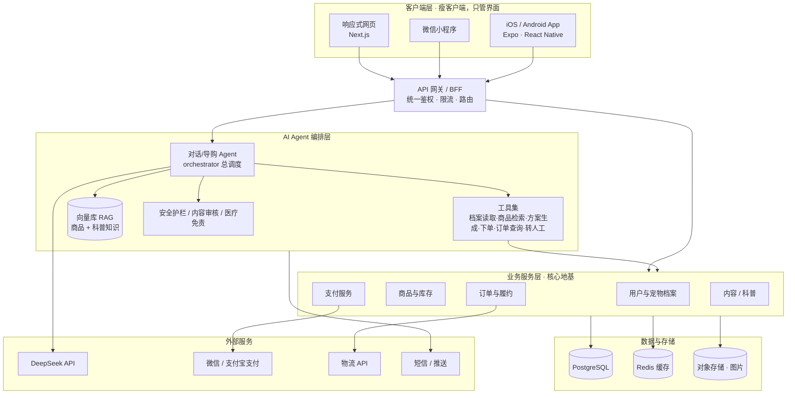

# Pawly 宝莉 · 架构与 Agent 设计

## 一、整体架构（API 优先 · 多端共用一套后端）



**一句话原则：** 业务逻辑只写一次（后端 API），所有端都是"瘦客户端"。AI Agent 不直接碰数据库，而是通过"工具(tools)"调用业务 API——这样 AI 和业务解耦，谁出问题都好查。

---

## 二、对 5-Agent 协作设计的评估

### ✅ 做得对的地方
- **能力(tools) 与 Agent 分开摆** —— 完全符合「Agent = 大模型 + 工具」的正确心智模型。
- 识别出「偏好分析 → 决策方案」这条链路，方向对（正是 Demo 跑通的流程）。
- 想到「科普社区」做内容，对留存和获客有价值。

### ⚠️ 我认为有问题、值得重想的地方

1. **C 端和 B 端混在一张图里了。**
   - 给**用户**的：客服、科普社区、偏好分析、决策方案。
   - 给**你自己运营**的：市场分析推荐（市场策略/营销获客/报表/Web 搜索）。
   - 这两套数据权限、安全要求完全不同，建议拆成两个独立系统，别让用户侧 Agent 碰到运营数据。

2. **过度拆分（5 个 Agent 对早期产品太多）。**
   - 每多一个 Agent = 多一次大模型调用 = 延迟↑、成本↑、出错点↑、调试难↑。
   - 「偏好分析」「决策方案」更适合做成**主 Agent 的工具/步骤**，而不是独立 Agent 互相喊话。

3. **职责边界重叠。**「推荐」同时出现在 市场分析推荐 / 决策方案 / 偏好分析 里——到底谁拍板？容易冲突。

4. **缺了几个关键能力（你邀请我指出的遗漏）：**
   - **订单/履约工具**：查物流、改地址、退换货——客服最高频，图里只有"发邮件/通知"。
   - **实时库存校验**：决策方案必须连实时库存，否则会推荐缺货商品。
   - **安全护栏 / 医疗免责 / 防越狱**：宠物健康问答尤其需要，图里完全没有。
   - **转人工兜底**：AI 搞不定时转人工，商业客服必备。
   - **记忆/用户画像持久化**：偏好分析的结果要存下来跨会话复用，别每次重算。

5. **没有"总调度(orchestrator)"。** 多 Agent 协作要明确谁是入口路由。建议：**统一入口 = 对话/客服 Agent**，由它判断该调用哪个能力。

### 🎯 我建议的精简版（早期更稳）

```
【面向用户】1 个主 Agent（导购/客服，做总调度）
   ├─ 工具：读宠物档案（偏好分析）
   ├─ 工具：商品检索（RAG + 实时库存）
   ├─ 工具：生成方案（决策方案）
   ├─ 工具：下单 / 查订单 / 退换货
   ├─ 工具：图像识别（拍包装/拍症状）
   ├─ 工具：科普知识检索
   ├─ 护栏：内容审核 + 医疗免责
   └─ 兜底：转人工

【面向你运营】另一套独立 Agent
   └─ 市场分析 / 营销获客 / 数据报表（绝不和用户系统共享权限）
```

**核心建议：把「偏好分析」「决策方案」从独立 Agent 降级为主 Agent 的工具**，等业务跑起来、单一 Agent 真的扛不住了，再按需拆成多 Agent。先简单跑通，再按瓶颈拆分。
```
```
