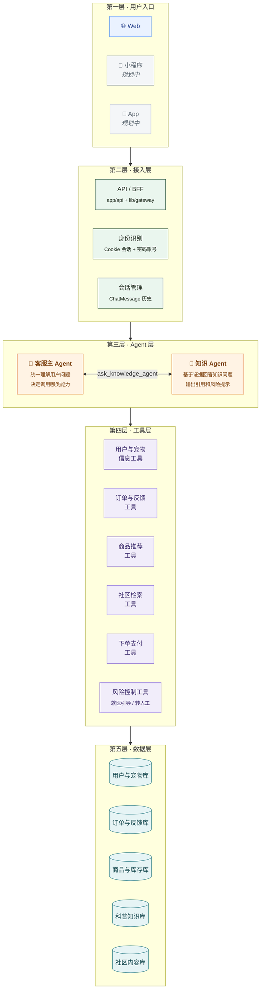

<div align="center">

# 🐾 Pawly 宝狸 · AI 宠物导购电商 + 养宠社区

**一个带 AI 养宠助手的宠物平台**。用户可以随口在对话里提到自家宠物，AI 会**读取专属宠物档案**，结合品种 / 年龄 / 体重 / 特点，从真实商品库挑选并生成可一键下单的购物方案；也能基于站内科普库回答养宠知识问题，并在高风险场景下主动提示就医。除电商外，还有完整的社区（发帖 / 评论 / 点赞 / 收藏 / 关注 / 私信 / 通知）与会员体系。

[](https://nextjs.org/)
[](https://www.typescriptlang.org/)
[](https://www.prisma.io/)
[](https://www.postgresql.org/)
[](https://platform.deepseek.com/)
[](https://vercel.com/)

### 🔗 在线体验：**https://pawly-xi.vercel.app**

</div>

---

## ✨ 功能总览

| 模块 | 已实现能力 |
|---|---|
| **AI 助手** | 主 Agent + 知识 Agent 双层编排；宠物档案自动建档、真实商品检索与排序、社区内容检索、科普问答、订单查询；证据不足时给通用建议 + 红旗信号 + 建议面诊，而不是一句"请就医"打发 |
| **商品电商** | 59 件商品（含详情、规格参数、评价）· 搜索与多维筛选 · 购物车 · 结算下单 · 订单列表 · 商品评价 |
| **宠物科普** | 37 篇科普文章（4 篇自动导入 + 33 篇精编），按物种 + 大类召回，带来源引用与白名单站点检索 |
| **社区** | 发帖 / 图文 / 评论 / 点赞 / 收藏 / 关注 / 瀑布流 / 全站搜索 |
| **账号体系** | 邮箱或手机号 + 密码 注册登录（scrypt 加盐哈希）· 唯一宝狸号 · 游客数据自动并入账号 · 修改密码 |
| **个人主页** | 参考小红书：头像照片上传、昵称/简介/性别/生日/常居地、星座、笔记 / 收藏 / 赞过三个页签、关注与粉丝名单 |
| **私信** | 一对一会话 · 图片（最多 3 张）与表情 · 已读回执 · 时间分组 · 未读角标 · 删除会话 · 按宝狸号/手机号/邮箱/昵称找人 |
| **通知** | 点赞 / 收藏 / 评论 / 关注 分类页签，带触发者头像，点击直达对应帖子 |
| **会员中心** | 概览 · 订单 · 宠物档案 · 健康提醒 · 地址管理 · 会员权益 · 每日签到 |

## 🏗️ 系统架构



> 小程序端与 App 端为规划中的入口；当前接入层同时服务 Web 与后续端，所以协议层已按多端设计。

## 🧠 Agent 设计

### 双 Agent 分工

早期版本是"单主 Agent + 工具"。随着科普库接入，知识问答对**证据约束**的要求和导购完全不同（必须带引用、必须能说"资料没覆盖"、必须能识别高风险），因此拆出独立的知识 Agent：

- **客服主 Agent**：统一理解问题、路由意图、决定调用哪些工具、组织最终回答。
- **知识 Agent**：只做知识问答。按物种 + 大类召回站内科普 + 白名单站点，产出带来源的结论与风险提示，再交回主 Agent。

两者通过 `ask_knowledge_agent` 工具连接，主 Agent 始终是唯一对用户说话的角色。

### 编排流水线

```
用户提问
  → routeIntent          意图路由：意图 / 置信度 / 是否高风险 / 推荐工具 / 宠物上下文
  → decideOrchestration  编排策略：允许哪几类证据、是否禁止推荐商品、回答顺序
  → 工具循环              各工具产出统一的「证据包」(AgentEvidencePacket)
  → buildPolicySystemHint 按策略与证据拼装约束，注入系统提示
  → 模型生成最终回答
```

**证据包（Evidence Packet）** 是各能力回传给主 Agent 的统一中间结构，带 `priority`（优先级）、`canDirectAnswer`（能否据此直接作答）、`shouldBlockRecommendation`（是否禁止顺带推荐商品）、`sources`（来源）、`cautions`（注意事项）等字段。主 Agent 不需要理解每个工具的私有格式，只按这套协议决策。

### 工具集

| 工具 | 作用 |
|---|---|
| `get_pet_profile` / `upsert_pet` | 读宠物档案 / 从对话中自动建档 |
| `search_products` | 检索真实在售商品 |
| `guidance_rank_products` | 按宠物特征对候选商品重排序并给出理由 |
| `community_search` / `community_summarize` | 检索并归纳社区真实经验 |
| `get_order_history` | 查询订单，支持售后类问题 |
| `ask_knowledge_agent` | 转交知识 Agent 做科普问答 |
| `create_order` | 一键下单 |
| `present_recommendation` | 结构化输出购物方案（走工具参数 schema，规避手写 JSON 失败） |

### 安全与边界

- **不因"资料没覆盖"就拒答**：站内没有完全对应资料时，按「说明情况 → 通用照护要点 → 红旗信号 → 建议面诊」的结构作答；始终禁止断言具体病因、给出药名剂量、伪造资料来源。
- **高风险识别**：`routeIntent` 标记高风险问题，编排层强制加上就医引导约束，并可禁止在该轮顺带推销商品。
- **密钥安全**：大模型 Key 只在服务端读取，前端经 `/api/chat` 间接调用；`/api/chat/diagnose` 只回连通性与错误分型，**绝不回显 Key**。
- **上游错误分型**：`no_key` / `auth` / `bad_request` / `rate_limit` / `server` / `network` 各自对应不同的用户可读提示，不再统一塌缩成一句"没组织好答案"。

## 🛠️ 技术栈

- **前端**：Next.js 14（App Router）+ React 18 + TypeScript
- **后端**：Next.js Route Handlers（Node.js 运行时）/ 可选独立 Express 进程
- **数据库**：PostgreSQL（Neon 或自建）+ Prisma ORM
- **AI**：DeepSeek API + Function Calling
- **部署**：Vercel 自动部署，或自有服务器（见 `docs/部署-自有服务器.md`）

## 🚀 本地运行

```bash
# 1. 安装依赖
npm install

# 2. 配置环境变量
#    .env       中填 DATABASE_URL=...      （Postgres 连接串）
#    .env.local 中填 DEEPSEEK_API_KEY=...  （DeepSeek 密钥，可参考 .env.local.example）

# 3. 同步数据库结构
npx prisma db push

# 4. 启动
npm run dev          # 打开 http://localhost:3000
```

## 📁 目录结构

前后端逻辑分离：`app/`+`components/`+`lib/` 是前端层（不接触数据库），`server/` 是后端层（业务/AI/数据）。两种运行模式：配置 `BACKEND_URL` 时后端作为独立进程只监听内网（自有服务器部署）；不配置时进程内直调（Vercel 演示，行为不变）。

```
app/
  page.tsx              前端入口（加载客户端 SPA）
  api/**/route.ts       BFF 瘦代理：解析会话 → 经 lib/gateway 转发到后端服务
components/
  App.jsx               SPA 壳与路由
  PagesShop.jsx         商品列表 / 详情 / 购物车 / 结算
  PagesCommunity.jsx    社区列表 / 发帖 / 详情 / 评论
  PagesOther.jsx        科普 / 会员中心（订单·宠物档案·提醒·地址·权益）
  PageProfile.jsx       个人主页（统计 / 笔记·收藏·赞过 / 关注粉丝名单）
  PageMessages.jsx      消息中心（会话列表 / 对话窗 / 找人）
  LoginDialog.jsx       登录注册弹窗（Portal 挂 body，避开毛玻璃containing block）
  ChatWidget.jsx        浮窗 AI 客服
  ui.jsx                通用组件（头像 / 顶栏 / 通知铃 / 浮动装饰）
lib/                    前端层共享代码（零数据库依赖）
  session.ts            匿名 Cookie 会话（随机 id，用户行由后端惰性创建）
  gateway.ts            前端层 → 后端服务的唯一通道（HTTP 转发或进程内直调）
  catalog.ts            商品种子数据（前后端共用的纯数据）
server/                 后端服务层（业务逻辑，独立进程时只监听 127.0.0.1）
  index.ts              分离模式入口（Express，x-internal-key 鉴权）
  services.ts           业务操作总表（49 个 op，校验 + 调度，两种模式共用）
  agent/
    runAgent.ts         主 Agent 工具循环
    routeIntent.ts      意图路由（意图/风险/推荐工具/宠物上下文）
    tools.ts            工具集定义与执行
    orchestration/      编排策略、证据包协议、护栏
    knowledge/          知识 Agent：检索 / 风险分级 / 呈现策略 / 来源登记
    guidance/           导购策略与商品重排序
    community/          社区检索与归纳
  db/store.ts           数据访问层
  auth.ts               注册登录 / 改密 / 宝狸号分配 / 游客数据合并
  password.ts           scrypt 哈希与校验、账号解析、密码强度
  deepseek.ts           DeepSeek 调用封装（Key 仅后端持有，错误分型）
  pets.ts               年龄 / 生命阶段 / 数据过期计算
content/                科普知识库（自动导入文章 / 来源登记 / 导入日志）
scripts/                科普导入、校验与覆盖率检查
prisma/schema.prisma    19 张表
docs/                   产品设计 / 架构 / 部署 / 商业计划文档
```

## 🗄️ 数据模型

19 张表，按域划分：

- **账号与资料**：`User`（含宝狸号、密码哈希、头像、性别生日常居地）· `Address` · `PhoneCode` · `CheckIn`
- **宠物**：`Pet` · `ReminderDone`
- **电商**：`Product` · `Order` · `Review`
- **社区**：`Post` · `Comment` · `PostLike` · `PostFavorite` · `Follow` · `Notification`
- **私信**：`Conversation` · `DirectMessage`
- **AI**：`ChatMessage` · `ChatUsage`

设计要点：

- **存出生日期而非年龄**：年龄实时算，用户零维护，狗狗长大也永远准确。
- **宝狸号唯一且易读**：8 位字符，字母表剔除 `0/O/1/I/L` 等易混字符。
- **会话按 ID 对归一化**：`userAId < userBId`，保证同一对人只有一条会话记录；未读数与已读时间各存一侧。
- **读消息不建会话**：只有真正发出消息才创建会话，避免"点开没发"留下空会话、"删除后轮询"把会话复活。
- **头像走独立接口**：图片存库、经 `/api/avatar/<userId>?v=<ts>` 以 `immutable` 缓存返回，列表接口的载荷不会被头像撑爆。
- **数据归属隔离**：宠物 / 订单 / 私信都按用户 id 隔离；社区帖子全站共享但按作者归属。

## ☁️ 部署

**Vercel**：推送到 GitHub 后自动构建部署。需配置环境变量（Production）：`DATABASE_URL`、`DEEPSEEK_API_KEY`、`PAWLY_MODEL`、`DEEPSEEK_BASE_URL`。

**自有服务器**：前后端可拆成两个进程，后端只监听 `127.0.0.1` 并用 `x-internal-key` 鉴权，详见 `docs/部署-自有服务器.md`。

## 🧭 后续规划

- **接入官方商品联盟 API**（京东联盟 / 淘宝客）：用真实商品替代演示数据，转"导购 + 返佣"模式。
- 微信小程序端与 App 端。
- 举报与机审、真实支付（待备案与资质审核完成后接入）。
- 科普库 RAG 向量检索，替换现有的物种 + 大类召回。

## ⚠️ 说明

当前为作品演示版本：商品为精选模拟数据，结算为演示流程（未接真实支付）。AI 回复仅供参考，宠物健康问题请咨询专业兽医。

---

<div align="center">
<sub>Made with 🐾 for 毛孩子 · Next.js · Prisma · DeepSeek</sub>
</div>
