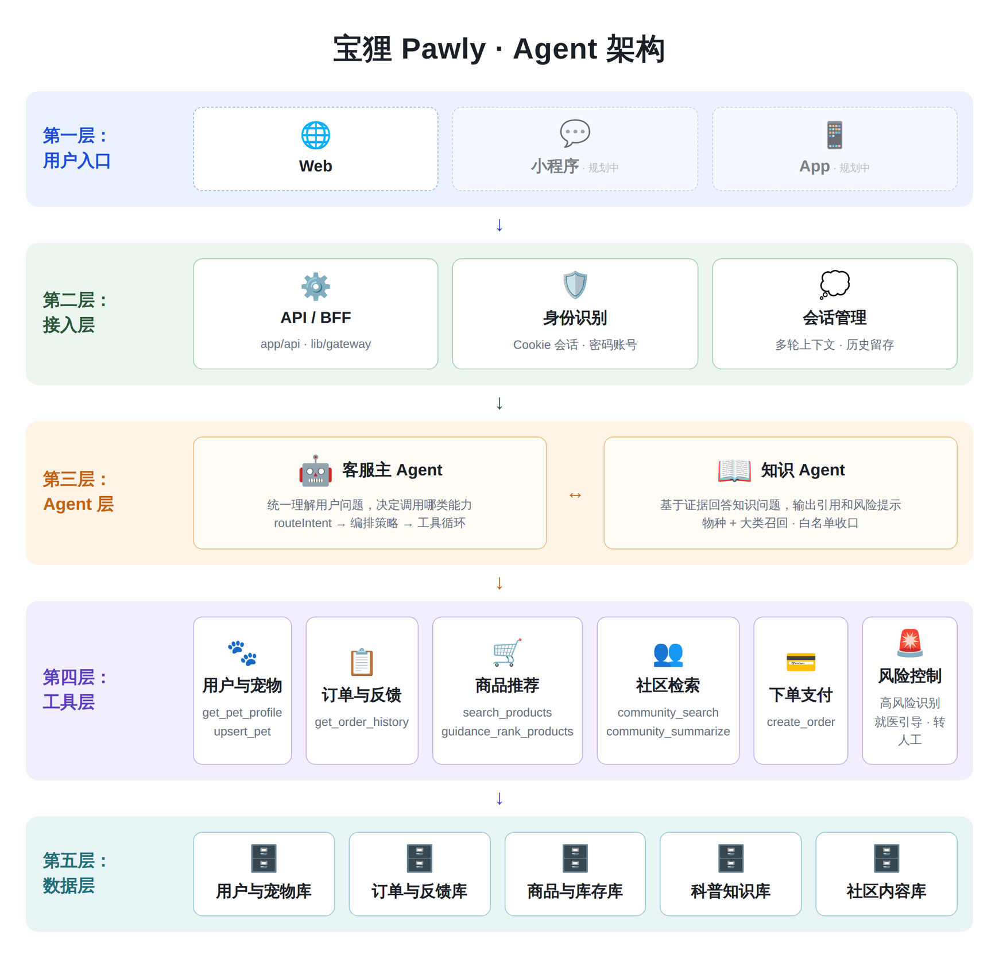

# Pawly 宝狸 · 架构与 Agent 设计

> 本文分两部分：**一、当前已实现的架构**（对着代码写的，可逐条核对）；**二、早期设计推演**（保留当时对 5-Agent 方案的评估，说明现在这套结构是怎么收敛出来的）。

---

# 一、当前架构（已实现）

<div align="center">
  
</div>

> 小程序端与 App 端为规划中的入口。当前只有 Web 端在跑，但接入层按多端设计，业务逻辑不写在客户端。

## 1.1 分层职责

| 层 | 代码位置 | 职责 |
|---|---|---|
| 用户入口 | `app/` `components/` | 只管界面，不碰数据库 |
| 接入层 | `app/api/**/route.ts` · `lib/gateway.ts` · `lib/session.ts` | 解析会话 → 校验 → 转发到后端服务；31 个路由全是瘦代理 |
| Agent 层 | `server/agent/` | 主 Agent 编排 + 知识 Agent |
| 工具层 | `server/agent/tools.ts` | Agent 唯一的对外手段，10 个工具 |
| 数据层 | `server/db/store.ts` · `prisma/schema.prisma` | 19 张表，唯一的数据访问入口 |

**一句话原则：** 业务逻辑只写一次（`server/services.ts` 的 49 个 op），所有端都是瘦客户端。AI Agent 不直接碰数据库，而是通过工具调用业务能力——AI 和业务解耦，谁出问题都好查。

**两种部署形态共用一套代码**：配置 `BACKEND_URL` 时后端作为独立 Express 进程只监听 `127.0.0.1`（自有服务器部署，`x-internal-key` 鉴权）；不配置时进程内直调（Vercel 演示）。切换形态不改业务代码。

## 1.2 为什么是两个 Agent

早期结论是"1 个主 Agent + 工具"（见第二部分）。接入科普库之后，知识问答暴露出和导购完全不同的约束：

| | 导购 | 知识问答 |
|---|---|---|
| 答案来源 | 商品库，结构化、可枚举 | 科普库 + 白名单站点，非结构化 |
| 错了的代价 | 推荐不合适，用户不买 | 可能延误就医 |
| 必须做的事 | 给方案、给理由 | 带引用、能承认"资料没覆盖"、能识别高风险 |

把这两套约束塞进同一个系统提示，结果是互相稀释——要么导购变得畏手畏脚，要么知识回答开始编来源。所以拆出**知识 Agent**：它只做知识问答，产出带来源的结论和风险标记，再交回主 Agent。

**主 Agent 始终是唯一对用户说话的角色**，知识 Agent 通过 `ask_knowledge_agent` 工具被调用，对用户不可见。这样避免了多 Agent 互相喊话带来的延迟叠加和调试黑洞。

## 1.3 主 Agent 编排流水线

```
用户提问
  ↓
routeIntent                  规则路由（不调模型）
  → intent / confidence / highRisk / strategy
  → recommendedTools[]
  → petContext（物种范围、目标品种、匹配模式）
  ↓
decideOrchestrationPolicy    编排策略
  → allowKnowledge / allowCommunity / allowGuidance
  → requiresProductToolEvidence（没有工具证据不许提商品）
  → shouldAvoidProposals（高风险时不许顺带推销）
  → responseOrder（证据在回答里的先后）
  ↓
工具循环（最多 8 步）          每个工具产出统一的「证据包」
  ↓
buildPolicySystemHint        按策略 + 证据拼装约束，注入系统提示
  ↓
模型生成最终回答
```

**为什么路由用规则而不是模型**：意图路由跑在每一轮对话上，用模型会让延迟和成本翻倍，而且路由错了很难复现。规则路由的代价是召回不够聪明，但它确定、可测、可以写单测。

## 1.4 证据包（Evidence Packet）

各能力回传给主 Agent 的统一中间结构，定义在 `server/agent/orchestration/types.ts`：

```ts
interface AgentEvidencePacket {
  kind: 'knowledge' | 'community' | 'guidance' | 'context';
  sourceTool: string;
  priority: 'high' | 'medium' | 'low';
  canDirectAnswer: boolean;            // 能否据此直接作答
  shouldBlockRecommendation: boolean;  // 是否禁止顺带推荐商品
  summary: string;
  details?: string[];
  sources?: string[];
  cautions?: string[];
  metadata?: Record<string, unknown>;
}
```

好处是主 Agent 不需要理解每个工具的私有返回格式，只按这套协议决策。新增一类能力（比如以后接入图像识别），只要产出证据包就能接进编排，不用改主循环。

## 1.5 工具集

| 工具 | 作用 |
|---|---|
| `get_pet_profile` | 读宠物档案 |
| `upsert_pet` | 从对话中自动建档（用户说"我家英短 3 岁 5 公斤"就存下来） |
| `search_products` | 检索真实在售商品 |
| `guidance_rank_products` | 按宠物特征对候选商品重排序并给出理由 |
| `community_search` | 检索社区真实经验 |
| `community_summarize` | 归纳社区内容（已确认不泄露他人隐私字段） |
| `get_order_history` | 查询订单，支持售后类问题 |
| `ask_knowledge_agent` | 转交知识 Agent 做科普问答 |
| `create_order` | 一键下单 |
| `present_recommendation` | 结构化输出购物方案 |

**为什么方案走工具参数而不是让模型写 JSON**：工具参数由 schema 约束生成，小模型手写 JSON 的失败率显著更高。这是把"格式正确性"从模型的自觉变成协议的保证。

## 1.6 知识 Agent

```
问题 + 物种/品种上下文
  → retrieveKnowledgeEvidence   多路召回并去重
      ├─ internalArticleRetriever   站内 76 篇科普，按物种 + 大类
      └─ whitelistSiteRetriever     权威站点目录（WSAVA / Merck / iCatCare 等）
  → 模型生成（带证据约束）
  → 白名单收口                    来源必须在登记表内
  → 风险分级                      高风险打标并透传转人工信号
  → 证据包回传主 Agent
```

**引用的诚实性**：只有真正读过全文的站内文章才写"参考"，白名单站点只写"可进一步查阅"——不能用没抓过的链接给自己的结论背书。

## 1.7 安全与边界

- **不因"资料没覆盖"就拒答。** 站内没有完全对应资料时，按「先说明情况 → 给通用照护要点 → 列红旗信号 → 建议尽快面诊」的结构作答。始终禁止：断言具体病因、给出药名剂量、伪造资料来源。
  > 这一条是修出来的：早期实现会在证据不足时用模板直接顶掉模型的回答，用户问"柴犬待产要准备什么"只能得到一句"建议尽快就医"，等于把"资料没覆盖"当成"不能说话"。
- **高风险识别**：`routeIntent` 标记高风险，编排层强制加就医引导约束，并可禁止该轮推销商品。
- **危险兜底文案已清除**：不再对无证据的高风险场景给任何居家处置建议（尿闭、中毒等急症下"少量多次补水"是危险指引）。
- **history 角色白名单**：客户端传来的消息在入口过滤为 user/assistant，防止注入伪造的 system 消息。
- **密钥安全**：模型 Key 只在服务端读取，前端经 `/api/chat` 间接调用。`/api/chat/diagnose` 只回连通性与错误分型，**绝不回显 Key**。
- **上游错误分型**：`no_key` / `auth` / `bad_request` / `rate_limit` / `server` / `network` 各自对应不同的用户可读提示，不再统一塌缩成一句"没组织好答案"。

## 1.8 已知短板

诚实记录，避免文档比实现好看：

1. **守门规则精度不足**：`guards.ts` 大量依赖正则与全等匹配，措辞稍变就可能误拒。方向是安全类保持硬阻断、体验类降为软提示。
2. **高风险状态无粘性**：路由只看最后一条消息，上一轮说"疑似中毒"、下一轮问"推荐点吃的"可以绕过阻断。风险标签需要跨轮保留。
3. **没有真正的转人工通道**：高风险信号已接通，但只到"建议就医"，没有人工坐席。
4. **`runAgentStream` 是伪流式**：事件全量缓冲、跑完才吐，且无路由使用。要么接真流式（`stream: true` + BFF SSE），要么删掉。
5. **分层倒挂**：`server/agent/knowledge/retrieval/internalArticles.ts` 反向 import 前端层的 `components/data`，文章数据应迁到 `lib/` 或入库。
6. **成本**：单次对话最多 8 步模型调用 + 知识 Agent 独立调用，额度只计 1 次。上线前需要压测与告警。
7. **科普检索还是关键词召回**，没上向量。

---

# 二、早期设计推演（保留）

> 以下是项目早期对"5 个 Agent 协作"方案的评估。结论"先收敛到 1 个主 Agent + 工具"在当时是对的；后来只在**知识问答**这一个真正扛不住的地方拆出了第二个 Agent，这正是当时说的"按瓶颈拆分"。

## 2.1 原 5-Agent 方案的问题

1. **C 端和 B 端混在一张图里。** 给用户的（客服、科普、偏好分析、决策方案）和给自己运营的（市场分析、营销获客、报表）数据权限完全不同，应拆成两个独立系统，别让用户侧 Agent 碰到运营数据。
2. **过度拆分。** 每多一个 Agent = 多一次模型调用 = 延迟↑成本↑出错点↑调试难↑。"偏好分析""决策方案"更适合做成主 Agent 的工具，而不是独立 Agent 互相喊话。
3. **职责边界重叠。** "推荐"同时出现在三个 Agent 里，到底谁拍板？
4. **缺关键能力**：订单/履约工具、实时库存校验、安全护栏与医疗免责、转人工兜底、记忆持久化。
5. **没有总调度。** 多 Agent 协作要明确入口路由。

## 2.2 当时建议的精简版

```
【面向用户】1 个主 Agent（导购/客服，做总调度）
   ├─ 工具：读宠物档案 / 商品检索 / 生成方案 / 下单查单 / 科普检索
   ├─ 护栏：内容审核 + 医疗免责
   └─ 兜底：转人工

【面向运营】另一套独立 Agent（绝不和用户系统共享权限）
```

## 2.3 后来实际怎么走的

| 当时的判断 | 现在的实现 |
|---|---|
| 主 Agent 做总调度 | ✅ `runAgent` + `routeIntent` + `orchestration` |
| 偏好分析降级为工具 | ✅ `get_pet_profile` / `upsert_pet` |
| 决策方案降级为工具 | ✅ `guidance_rank_products` / `present_recommendation` |
| 补订单工具 | ✅ `get_order_history`（只读，无售后提交） |
| 补安全护栏 | ✅ 风险分级 + 就医引导 + 守门层 |
| 补转人工 | △ 信号已接通，通道未建 |
| 记忆持久化 | ✅ 宠物档案入库，跨会话复用 |
| 实时库存校验 | ⬜ 未做（演示数据） |
| 运营侧独立系统 | ⬜ 未做 |
| 按瓶颈再拆 Agent | ✅ 知识问答扛不住，拆出知识 Agent |
