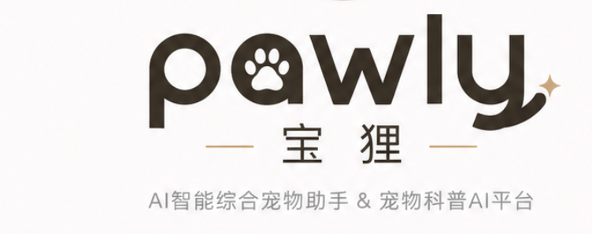

# Pawly 宝狸 · 品牌与商标规范

> 本文件是品牌资产的**唯一事实来源**。改动 Logo、主色或商标形态前，先更新这里。

## 商标（Trademark）

**Pawly 宝狸的商标已确定为圆形小狸猫头像**，即下图这一版，不再使用其它候选方案。

| 项目 | 内容 |
|---|---|
| 形态 | 圆形，浅棕底 + 白色面部 + 深棕下弧，双圆耳 |
| 文件 | [`public/brand/pawly-mark.png`](../public/brand/pawly-mark.png)（300×300 PNG，透明底） |
| 用途 | App 图标、favicon、头像、公众号/小红书头像、路演 PPT 右上角角标 |
| 状态 | 设计已定稿，商标注册申请待提交 |
| 禁止 | 拉伸变形、改色、加描边或阴影、把圆形裁成方形 |

## 组合标（Logo Lockup）

圆形商标 + `pawly` 字标 + `宝狸` 中文名 + 一行副标，用于需要完整品牌呈现的场合
（官网页头、PPT 封面、对外文档封面）。

文件：[`public/brand/pawly-logo-lockup.png`](../public/brand/pawly-logo-lockup.png)（752×298 PNG）

副标文案：`AI智能综合宠物助手 & 宠物科普AI平台`

## 主色板

对外材料（网站、PPT、宣传图）统一使用这套暖棕色系，不要引入蓝色等外来色。

| 色值 | 用途 |
|---|---|
| `#2E2822` | 主标题、正文重点 |
| `#4A3729` | 深棕，卡片标题、强调块 |
| `#C79255` | 品牌金棕，重点数字、行内强调、装饰短线 |
| `#E0B77F` | 浅金棕，时间轴当前节点 |
| `#7D746C` | 正文灰 |
| `#B8AEA5` | 注释、脚注 |
| `#E8D7C2` / `#F5EEE5` / `#FAF6F0` | 卡片与提示条底色 |
| `#72866F` / `#A85E4A` | 辅助绿 / 辅助红，仅用于正负指标 |

## 字体

中文与西文统一 **PingFang SC**；无该字体的环境回落到系统无衬线（Windows 上为微软雅黑）。

## 命名

- 中文全称：**Pawly 宝狸**（首次出现用全称，之后可简称「宝狸」或「Pawly」）
- 英文字标全小写：`pawly`
- 用户 ID 体系称为「宝狸号」
